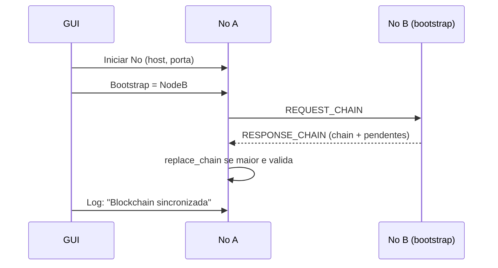
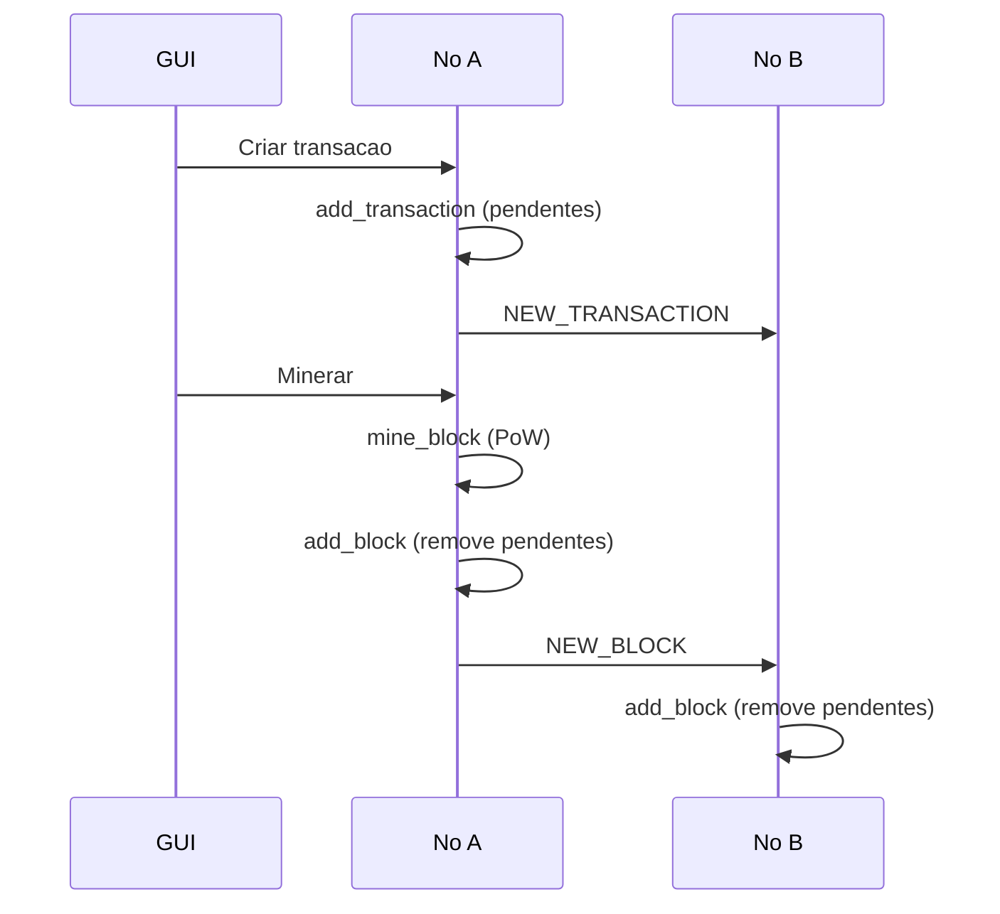

# Relatorio GUI e Network (Passo a Passo)

## Arquivos principais
- `src/lsdchain/gui/app_tk.py` (GUI com Tkinter)
- `src/lsdchain/network/node.py` (No P2P e sockets TCP)
- `src/lsdchain/network/protocol.py` (Formato das mensagens)
- `src/lsdchain/core/blockchain.py` (Validacao e cadeia)
- `src/lsdchain/core/mining.py` (Proof of Work)
- `src/lsdchain/core/transaction.py` (Transacoes)

## GUI passo a passo
1. O usuario executa `python main.py` e a GUI e aberta.
2. Na area "Configuracao do No", o usuario informa `host`, `porta` e `bootstrap` (opcional).
3. Ao clicar em "Iniciar No", a GUI cria o no (`Node`) e inicia o servidor TCP (`src/lsdchain/network/node.py`).
4. Se houver bootstrap, a GUI tenta conectar aos peers e sincroniza a blockchain (`REQUEST_CHAIN`).
5. Para criar transacao, o usuario preenche origem, destino e valor e clica em "Enviar".
6. A GUI valida o formato `host:porta` e chama `Node.broadcast_transaction`.
7. A lista de pendentes pode ser exibida no log (botao "Pendentes").
8. Ao clicar em "Minerar", a GUI chama `Node.mine`, que cria um novo bloco com coinbase + pendentes.
9. O botao "Blockchain" lista os blocos no log.
10. O botao "Peers" mostra os peers conectados.
11. O usuario pode conectar manualmente um peer (campo "Peer Manual").
12. O botao "Consultar" mostra saldo do endereco informado.
13. Ao fechar a janela, o no e encerrado.

## Network passo a passo
1. Cada no abre um socket TCP e fica aguardando conexoes (`Node.start`).
2. As mensagens seguem o padrao `[4 bytes tamanho][JSON UTF-8]`.
3. Quando chega `NEW_TRANSACTION`:
4. O no valida e adiciona ao pool de pendentes (`Blockchain.add_transaction`).
5. Se aceita, propaga a transacao para os peers (`broadcast`).
6. Quando chega `NEW_BLOCK`:
7. O no valida hash, PoW e transacoes (`Blockchain.is_valid_block`).
8. Se valido, adiciona o bloco e remove pendentes incluidas.
9. O bloco e propagado para outros peers.
10. Quando chega `REQUEST_CHAIN`:
11. O no responde com `RESPONSE_CHAIN` contendo a cadeia e pendentes.
12. Quando chega `RESPONSE_CHAIN`:
13. O no valida a cadeia recebida e troca se for maior.

## Diagrama de sequencia (entrada do no e sincronizacao)

## Diagrama de sequencia (transacao + mineracao)

